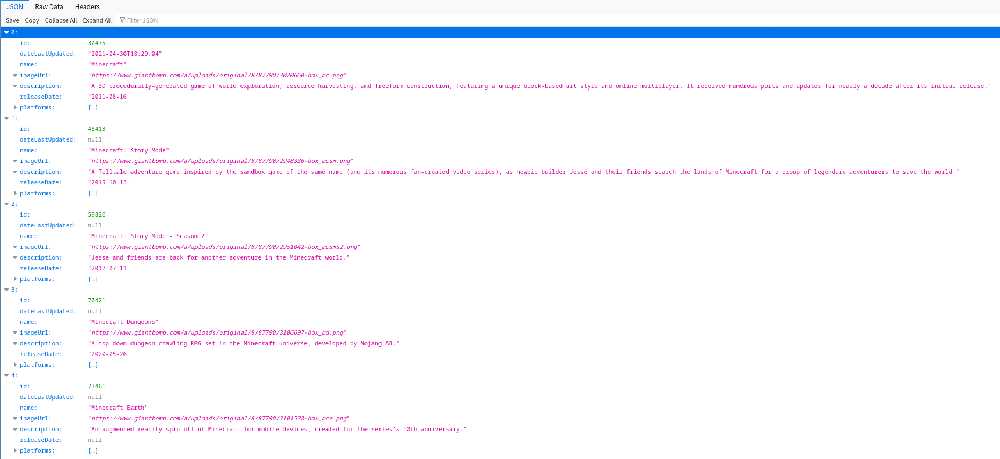

# Game Lists Server

Server for interaction between [Game List](https://github.com/IceArrow256/game_lists) and [Giant Bomb](https://www.giantbomb.com/).

## Usage

### Linux
```
$ git clone https://github.com/IceArrow256/game_lists_server.git
$ cd game_lists_server
$ python -m venv game_lists_server
$ source game_lists_server/bin/activate
$ pip install -r requirements.txt
$ cp .env.example .env
$ gunicorn game_lists_server.__main__:app --reload -b 0.0.0.0:8000
or
$ python -m game_lists_server
```
### Windows
```
$ git clone https://github.com/IceArrow256/game_lists_server.git
$ cd game_lists_server
$ python -m venv game_lists_server
$ game_lists_server\Scripts\[activate|activate.bat|Activate.ps1]
$ pip install -r requirements.txt
$ copy .env.example .env
$ python -m game_lists_server
```

Make sure that you placed valid [Giant Bomb API Key](https://www.giantbomb.com/api/) in the .env file.

Server has 2 type of requests:
- Search request /search?query=%name%
- Getting game data request /game/%id%

### Example


http://127.0.0.1:8000/search?query=minecraft




## License

This project is licensed under the [MIT License](LICENSE).

## Thanks
- [Giant Bomb](https://www.giantbomb.com)
